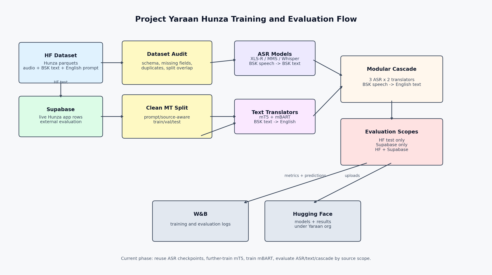

# Burushaski Model Training - Project Yaraan

Training code for the Burushaski speech and translation models used in Project Yaraan. The current training path keeps ASR and translation separate so each part can be checked properly.

Training data comes from linked project sources:
- **Hugging Face** - versioned consolidated datasets under the `Yaraan` organization
- **Supabase** - live PWA database and storage for newly collected recordings

Training runs on RunPod.



---

## Scope

This branch contains the Hunza-focused ASR, translation, and cascade evaluation pipeline:

- XLS-R ASR training: implemented in `train/xlsr.py`
- mT5 text translation training: implemented in `train/mt5.py`
- mBART text translation training: implemented in `train/mbart.py`
- ASR comparison for XLS-R, MMS, and Whisper checkpoints: implemented in `evaluate/asr_all.py`
- mT5, mBART, and cascade evaluation scripts: implemented in `evaluate/`
- HF/Supabase dataset audits: implemented in `analysis/`
- shared data loading from HF/Supabase: implemented in `data/loader.py`

TTS and SeamlessM4T are outside this branch's current training run.

---

## Current Model Plan

Main speech-to-English cascade:

```text
Burushaski audio -> XLS-R/MMS/Whisper ASR -> Burushaski text -> mT5 or mBART -> English text
```

Text translation:

```text
Burushaski text -> mT5 or mBART -> English text
```

Whisper is used with audio input. It is not used as a Burushaski-text-to-English text model.

This branch is Hunza-only for the current experiments. The translation model still keeps dialect tags in the prompts.

The ASR checkpoints are reused as-is for now. Text translation uses a cleaned prompt/source-aware MT split built from the Hugging Face Hunza parquets. Supabase Hunza rows are used for external evaluation, not for the current training baseline.

---

## RunPod Setup

When you clone this repo onto a new RunPod pod, run these in order:

**1. Install dependencies**
```bash
bash setup/setup.sh
```
This installs pip packages, creates `.env` from the template, and validates that all required env vars are set.

**2. Fill in `.env`**
```
HF_TOKEN=           # Hugging Face token (for private dataset access)
SUPABASE_URL=       # Supabase project URL
SUPABASE_SERVICE_ROLE_KEY=  # Supabase service role key, preferred
SUPABASE_KEY=       # Alternative name for the same service role key
WANDB_API_KEY=      # Weights & Biases API key
WANDB_PROJECT=      # Weights & Biases project name (e.g. yaraan-hunza-xlsr-mt5)
CACHE_DIR=          # Optional: set to network volume path to persist audio cache across pods
```

**3. Download base models**
```bash
python setup/download_models.py
```
Pre-downloads model weights so training doesn't fetch them mid-run.

To also cache the trained ASR checkpoints used during comparison:

```bash
python setup/download_models.py --include-trained
```

**4. Verify GPU and environment**
```bash
python setup/verify_environment.py
```

**5. Check data access before training**
```bash
python test_run_loader.py --task asr --split train --use-hf --dialect hunza
python test_run_loader.py --task mt --split train --use-hf --dialect hunza
python test_run_loader.py --task asr --split test --use-hf --use-supabase --dialect hunza
python test_run_loader.py --task mt --split test --use-hf --use-supabase --dialect hunza
python test_run_loader.py --task asr --split test --use-supabase --dialect hunza --source supabase --decode-audio
```

**6. Run short checks first**
```bash
python analysis/audit_hf_parquets.py
python analysis/audit_supabase.py --dialect hunza
python analysis/build_clean_mt_dataset.py
python train/mt5.py --config configs/mt5_clean.yaml --max-steps 5 --max-train-samples 32 --max-eval-samples 16
python train/mbart.py --config configs/mbart_clean.yaml --max-steps 5 --max-train-samples 32 --max-eval-samples 16
python test_translation_smoke.py --config configs/mt5_clean.yaml --forward
```

These commands only run a few optimizer steps. Use them to check that training, saving, and reloading work before starting the full run.

After the translation models are saved, these two commands check the comparison scripts on a tiny sample before running the full evaluation:

```bash
python evaluate/asr_all.py --use-hf --use-supabase --max-samples 2
python evaluate/asr_source_scopes.py --max-samples 2
python evaluate/translation_source_scopes.py --max-samples 2
python evaluate/cascade_source_scopes.py --max-samples 2
```

**7. Train text translation**
```bash
python analysis/build_clean_mt_dataset.py
python train/mt5.py --config configs/mt5_clean.yaml
python train/mbart.py --config configs/mbart_clean.yaml
```

The clean MT builder creates a prompt/source-aware split from the HF parquet data. The same normalized English prompt and the same normalized Burushaski source are kept out of multiple splits.

**8. Evaluate**
```bash
# Single-model checks
python evaluate/xlsr.py --model-path outputs/asr-xlsr_final --use-hf --use-supabase
python evaluate/mt5.py --model-path outputs/mt5-hunza-clean_final --config configs/mt5_clean.yaml --split test
python evaluate/mbart.py --model-path outputs/mbart-hunza-bsk-eng-clean_final --config configs/mbart_clean.yaml --split test

# Model comparison
python evaluate/asr_all.py --use-hf --use-supabase
python evaluate/asr_source_scopes.py
python evaluate/translation_source_scopes.py
python evaluate/cascade_source_scopes.py
```

Evaluation writes detailed predictions plus summary CSV, JSON, and short readable TXT files under `outputs/.../results`. If `WANDB_API_KEY` is set, the summary metrics and result files are also attached to the W&B run.

Saved prediction CSVs can be rescored later without retraining:

```bash
python evaluate/saved_predictions.py --task asr --predictions outputs/asr-xlsr/results/xlsr_predictions.csv --output outputs/recomputed_metrics/xlsr
python evaluate/saved_predictions.py --task mt --predictions outputs/text-translation/mt5/hf_clean_test/mt5_predictions.csv --output outputs/recomputed_metrics/mt5
```

**9. Upload final checkpoints to Hugging Face**
```bash
hf upload Yaraan/mt5-hunza-bsk-eng-v1 outputs/mt5-hunza-clean_final .
hf upload Yaraan/mbart-hunza-bsk-eng-v1 outputs/mbart-hunza-bsk-eng-clean_final .
hf upload Yaraan/mt5-hunza-bsk-eng-v1 outputs/text-translation/mt5 clean-eval-results
hf upload Yaraan/mbart-hunza-bsk-eng-v1 outputs/text-translation/mbart results
hf upload Yaraan/yaraan-hunza-asr-source-scope-results outputs/asr-all .
hf upload Yaraan/yaraan-hunza-clean-cascade-results outputs/cascade-all .
```

For a fresh run, the training scripts can also upload automatically after training:

```bash
python train/mt5.py --config configs/mt5_clean.yaml --push-to-hub
python train/mbart.py --config configs/mbart_clean.yaml --push-to-hub
```

---

## Hugging Face Access

Private Hugging Face datasets cannot be cloned with your account password. Use a user access token.

On RunPod, the easiest path is usually:

```bash
huggingface-cli login
```

Paste a token from Hugging Face settings. For this repo, set the same token in `.env` too:

```text
HF_TOKEN=hf_...
```

If Windows Git Credential Manager keeps opening a dialog when cloning locally, set the provider manually:

```powershell
git config --global credential.https://huggingface.co.provider generic
```

Then clone with a token when Git asks for a password. Username can be your HF username; password is the token.

You do not need to clone the dataset for normal training if `HF_TOKEN` is set. The training scripts use the Hugging Face `datasets` library and read the configured repo directly.

---

## Project Structure

```
configs/
  datasets.yaml        # HF repo IDs for linked dataset loading
  model_registry.yaml  # ASR/translation checkpoints used in evaluation
  asr_xlsr.yaml        # XLS-R ASR settings
  mt5_clean.yaml       # mT5 run using the cleaned prompt/source-aware MT split
  mbart_clean.yaml     # mBART run using the same clean MT split

analysis/
  audit_hf_parquets.py       # checks HF parquet rows, duplicates, and train/test overlap
  audit_supabase.py          # checks current Supabase row readiness
  build_clean_mt_dataset.py  # creates a cleaner prompt/source-aware MT split

data/
  loader.py            # entry point: load_dataset(...)
  audio_io.py          # loads local path audio and HF Audio dictionaries
  manifest.py          # builds canonical JSONL manifests when needed
  normalization.py     # light Burushaski/English text normalization
  sources/
    hf.py              # loads from HuggingFace Hub
    supabase.py        # loads from Supabase recordings table
  storage/
    audio.py           # downloads audio from Supabase Storage, caches locally

setup/
  setup.sh             # RunPod bootstrap script
  download_models.py   # pre-downloads model weights
  verify_environment.py  # checks CUDA, GPU memory

train/
  xlsr.py              # fine-tune XLS-R CTC ASR
  mt5.py               # fine-tune mT5 text translation
  mbart.py             # fine-tune mBART text translation
evaluate/
  xlsr.py              # compute ASR CER/WER
  asr_all.py           # compare XLS-R, MMS, and Whisper ASR checkpoints
  asr_source_scopes.py # runs ASR comparison on HF-only, Supabase-only, and combined scopes
  mt5.py               # compute MT chrF++/BLEU
  mbart.py             # compute mBART MT chrF++/BLEU
  translation_source_scopes.py # compares mT5/mBART on clean-HF, Supabase, and combined scopes
  cascade_all.py       # compare ASR -> text translator cascades
  cascade_source_scopes.py # runs cascade comparison on HF-only, Supabase-only, and combined scopes

```

---

## Data

The ASR path uses the linked Hugging Face train/test data directly. For MT, the raw HF rows are first converted into a prompt/source-aware text split:

```bash
python analysis/build_clean_mt_dataset.py
python train/mt5.py --config configs/mt5_clean.yaml
```

The live app stores recordings in Supabase. The training loader reads from `active_recordings` and only keeps rows that have the fields needed for the current task:

- ASR: `audio_path` + `transcript`
- MT: `transcript` + `english_translation`

Audio files are stored in Supabase Storage under `dialect/participant_id/module_id/` paths and cached locally under `cache/audio/` (or `CACHE_DIR` if set). Older app recordings may be `.m4a`; newer browser-friendly recordings may be `.webm`.

The Hugging Face consolidated dataset is configured in `configs/datasets.yaml`. Supabase data is not used for training in the current run. It is added during evaluation so the final reports cover HF-only, Supabase-only, and combined Hunza scopes.

The old translation workbook is text-only. If those rows are needed for RunPod training, fold them into an online dataset first rather than reading an `.xlsx` from a local machine.

To export a task-specific manifest:

```bash
python data/manifest.py --task mt --split train --use-hf --use-supabase --dialect hunza --output data/manifests/train_hunza_mt.jsonl
```

---

## Evaluation

The evaluation scripts run after a checkpoint exists and write fresh metrics from the selected test data.

ASR is evaluated with both raw and normalized:

- `WER`: word error rate
- `CER`: character error rate
- word accuracy
- character accuracy
- sentence error rate
- exact match rate
- empty prediction rate
- average reference/prediction length

CER is especially important here because Burushaski spelling is not fully standardized, and character-level mistakes are more informative than only counting whole-word errors. The evaluator also writes group summaries by dialect, participant, and gender.

Text translation and speech-to-English outputs are evaluated with:

- `chrF++`
- `BLEU`
- `TER`
- exact match rate
- empty prediction rate
- average length ratio

`chrF++` is useful for low-resource and spelling-variable settings because it gives credit for character n-gram overlap, while BLEU remains a common comparison point in MT and speech-translation papers.

The text translation evaluators write predictions and metric summaries for the clean MT test split. They can also evaluate Supabase rows when `--use-supabase` is passed.

The cascade evaluator compares the available ASR-to-text-translation systems on the same test set:

```text
XLS-R predicted transcript -> mT5/mBART -> English
MMS predicted transcript -> mT5/mBART -> English
Whisper predicted transcript -> mT5/mBART -> English
```

This shows how much translation quality changes depending on which ASR transcript is fed into the text translator.

For this phase, the expected comparison tables are:

- ASR: 3 ASR models x 3 source scopes = 9 result rows
- Text translation: 2 translators x 3 source scopes = 6 result rows
- Cascade: 3 ASR models x 2 text translators x 3 source scopes = 18 result rows

---

## Known Limitations

- **HuggingFace private access** - set `HF_TOKEN` before using `--use-hf`.
- **Supabase `--use-supabase` flag** - use a service role key in `.env`. Do not paste it into notebooks or logs.
- **ASR split policy** - ASR checkpoints are evaluated on HF-only, Supabase-only, and combined Hunza scopes.
- **MT split policy** - text translation uses the clean prompt/source-aware split generated from the HF parquets.
- **HF upload policy** - mT5 updates `Yaraan/mt5-hunza-bsk-eng-v1`; mBART uses `Yaraan/mbart-hunza-bsk-eng-v1`.
